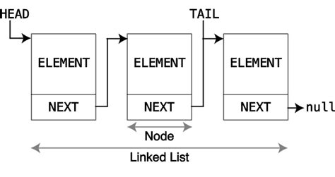
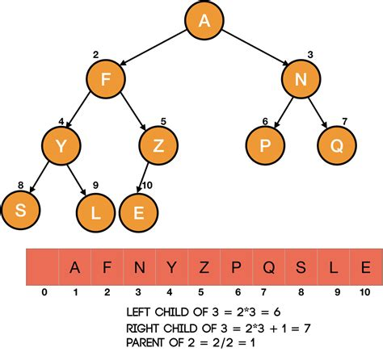

# Data structures in c
Here you will find different data structures and when use them 

## Data structures 
- Stack
- Queue
- Dynamic stack
- Priority list
- Singly linked list
- Doubly linked list
- Binary tree

### How stack works
Stack is a data structure in which the operations of insertion and removal are performed in the same end, called TOP. The stack is also known as the LIFO (Last in, first out).

Operations associated with a stack: 
- Start an empty S-stack
- Insert (push) into S-stack 
- Delete (pop) from S-stack
- Check that stack S is empty
- Check that the stack is full

Example of using Stacks: 
- Processing of calls from subroutines and their returns
- Systems simulation
- Well-formed sequences
- Return of browser pages
- Controls of application screens on mobile devices

### How Queue works
It is a linear list in which all removals are made in a end called start and all inserts are made in the other end called end. Queues are called structures FIFO (First In First Out), because the first inserted element is the first to be removed.

### How Dynamic stack works
It is the same as previous stack, but in the Dynamic Stack Structure, we do not have the restriction of the vector size, only memory space that are allocated according to the need (demand), not wasting memory spaces.

### How Singly linked list works
It is the dynamic structure for queues. In linked lists, consecutive elements in the queue do not imply in consecutive elements in memory (the order is logical). In the implementation it is necessary to store separately the information from an element of the list, usually the first.

### How Doubly linked list works
This structure is almost the same as the previous, the difference between them is that the doubly linked list knows who is the next and the previous in the sequence.

### How Priority list works
It works same as the other lists, but the structure have priority while removing or listing data.

### How Binary tree works
A binary tree is a data structure in which each node has at most two children, which are referred to as the left child and the right child.

